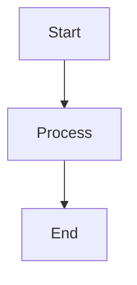
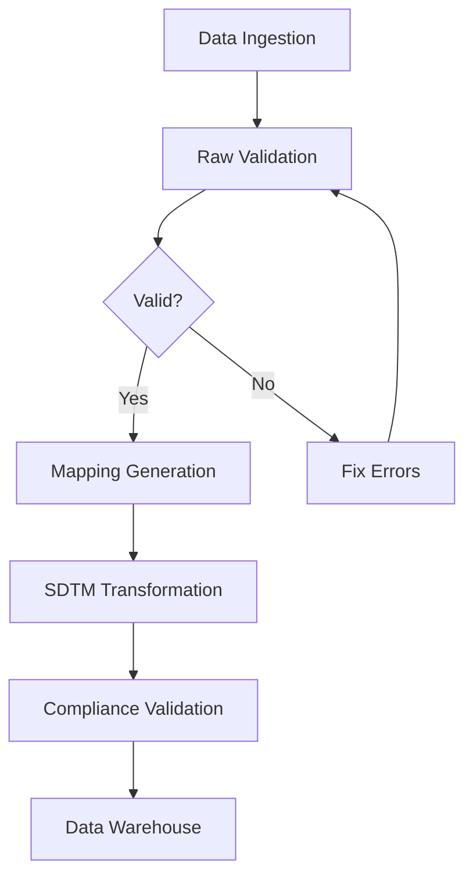
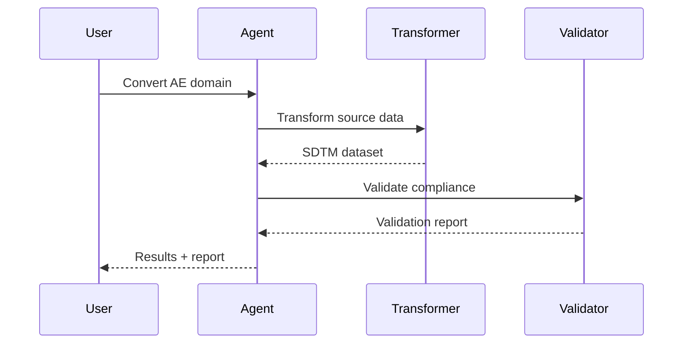
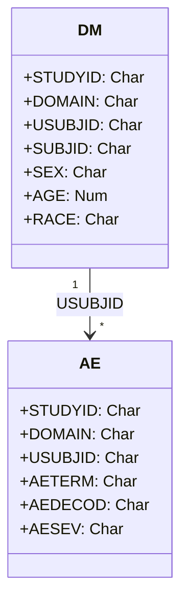
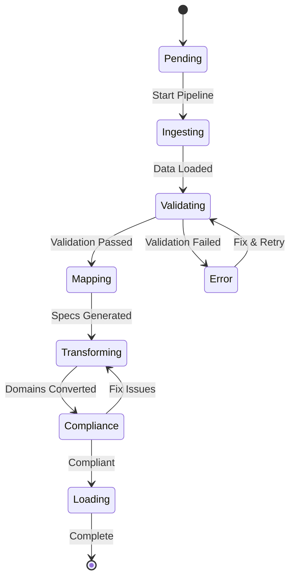
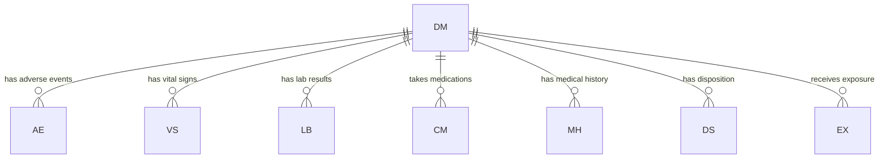
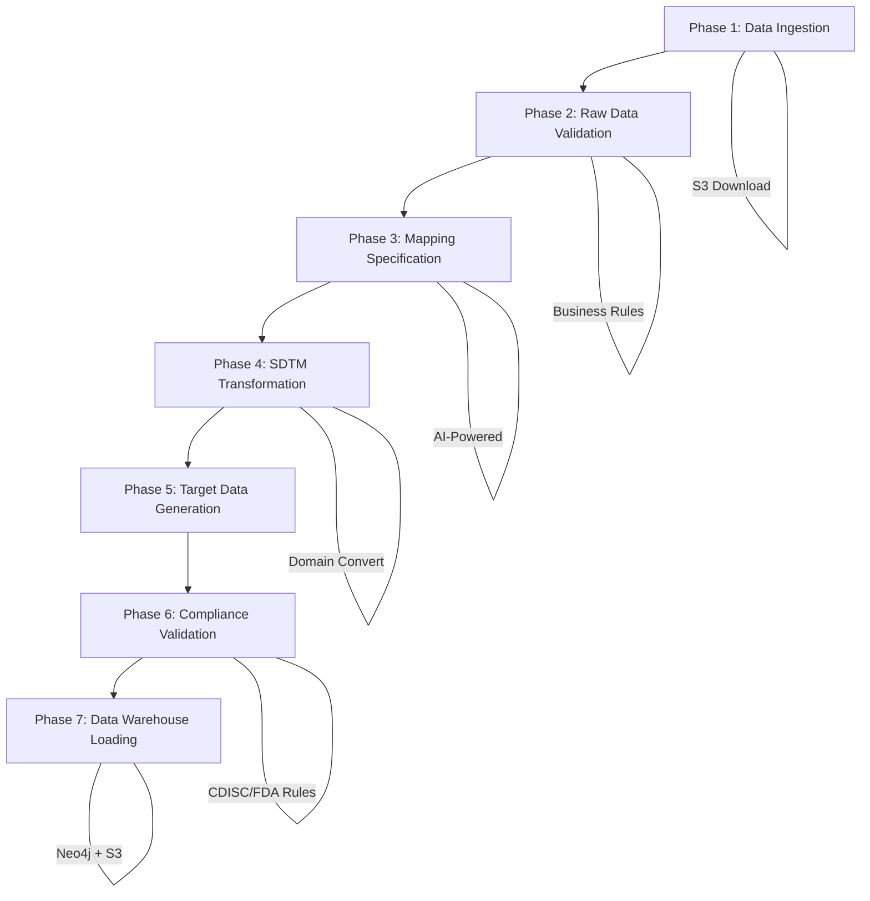
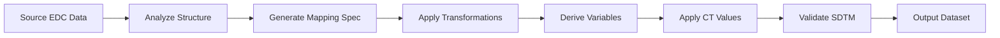
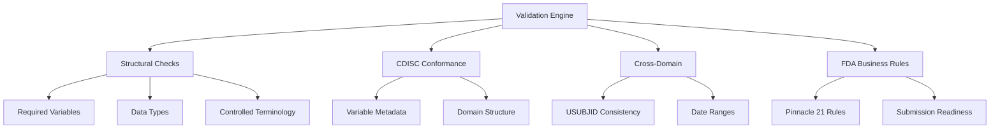

# Mermaid Diagrams Skill

## Overview

This skill enables the agent to generate visual diagrams rendered directly in the chat window.
When describing processes, workflows, relationships, or architectures, generate a Mermaid diagram
using a fenced code block with the `mermaid` language tag.

## When to Use

Generate a Mermaid diagram whenever the user asks about or you need to illustrate:

- **Pipeline flows**: ETL pipeline phases, data transformation steps
- **Domain relationships**: How SDTM domains relate to each other
- **Data lineage**: Source-to-target data flow and transformations
- **Validation workflows**: How validation rules are applied
- **Process architectures**: System architecture, agent orchestration
- **Decision trees**: Mapping logic, conditional transformations
- **Sequence diagrams**: API interactions, tool call flows
- **State diagrams**: Pipeline states, domain conversion lifecycle

## Code Block Format

Always output Mermaid diagrams using this exact format:

```

```

IMPORTANT: The code block MUST use the language tag `mermaid`. The frontend will detect this
and render an interactive SVG diagram.

## Supported Diagram Types

### Flowchart (graph TD / graph LR)

Use for process flows, pipelines, and decision trees.

```

```

- `graph TD` = top-down flow
- `graph LR` = left-to-right flow
- `[text]` = rectangle node
- `{text}` = diamond (decision) node
- `([text])` = rounded rectangle
- `((text))` = circle
- `-->` = arrow
- `-->|label|` = labeled arrow
- `---` = line without arrow

### Sequence Diagram

Use for API interactions, tool call flows, and agent communication.

```

```

### Class Diagram

Use for data models, domain structures, and schema relationships.

```

```

### State Diagram

Use for pipeline states and domain conversion lifecycle.

```

```

### Entity Relationship Diagram

Use for database schemas and domain relationships.

```

```

## SDTM-Specific Templates

### 7-Phase ETL Pipeline

When asked about the SDTM pipeline, use this template:

```

```

### Domain Transformation Flow

When explaining how a domain is transformed:

```

```

### Validation Hierarchy

When explaining validation:

```

```

## Rules

1. **Always use mermaid code blocks** - Never describe a flow as plain text when a diagram would be clearer
2. **Keep diagrams focused** - Show the most relevant nodes; avoid cluttering with too many details
3. **Use descriptive labels** - Node text should be clear and concise
4. **Choose the right diagram type** - Flowcharts for processes, sequence diagrams for interactions, ER diagrams for data models
5. **Use consistent styling** - Follow the templates above for SDTM-specific diagrams
6. **Combine with text** - Always include a brief explanation alongside the diagram
